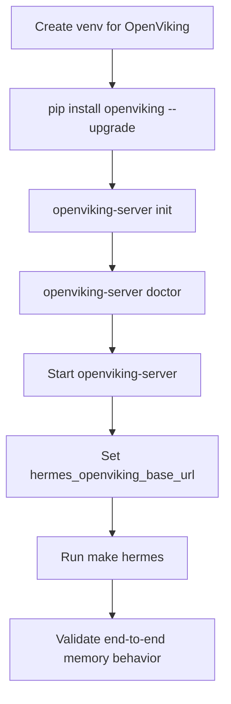

# W-deplyer

Ansible-based deployer for W infrastructure.

## Playbooks

The repository now has dedicated playbooks for each step:

1. Install Docker: `playbooks/install_docker.yml`
2. Install Traefik (Docker Compose): `playbooks/install_traefik.yml`
3. Install OpenViking: `playbooks/install_openviking.yml`
4. Install Hermes: `playbooks/install_hermes.yml`
5. Log in to custom Docker registry: `playbooks/docker_registry_login.yml`
6. Pull `w-bridge:latest`: `playbooks/pull_w_bridge_image.yml`
7. Run `w-bridge` container: `playbooks/run_w_bridge_container.yml`

Also included:
- Full orchestrator: `playbooks/site.yml`
- Required collection list: `requirements.yml`

## Quick Start

1. Configure inventory in `inventory/W.ini`.
2. Install Ansible collections:

```bash
make deps
```

3. Run all steps:

```bash
make deploy-all
```

Or run one step at a time:

```bash
make docker
make traefik
make openviking
make hermes
make registry-login
make pull-w-bridge
make run-w-bridge
```

## Password Prompts (Vault / Sudo)

Use Makefile passthrough args when Ansible needs a password prompt.

Prompt for Ansible Vault password:

```bash
make deploy-all ANSIBLE_ARGS='--ask-vault-pass'
```

Prompt for sudo/become password:

```bash
make deploy-all ANSIBLE_ARGS='--ask-become-pass'
```

Prompt for both:

```bash
make deploy-all ANSIBLE_ARGS='--ask-vault-pass --ask-become-pass'
```

You can combine these with variables, for example:

```bash
make hermes ANSIBLE_ARGS='--ask-vault-pass' EXTRA_VARS='-e hermes_api_server_key=YOUR_KEY'
```
for api server key you could use:
```bash
openssl rand -hex 32
```

## Runtime Variables

Common variables you should override:

- `docker_registry_url`
- `docker_registry_username`
- `docker_registry_password`
- `w_bridge_registry`
- `w_bridge_image_name` (default: `w-bridge`)
- `w_bridge_image_tag` (default: `latest`)
- `w_bridge_ports` (example: `["8080:8080"]`)

Example:

```bash
ANSIBLE_CONFIG=./W.cfg ansible-playbook playbooks/pull_w_bridge_image.yml \
	-e "w_bridge_registry=my-registry.example.com"
```

## Secret .env File: Secure Options

There are two supported ways to provide the container `.env` file in `playbooks/run_w_bridge_container.yml`.

### Option A: Ansible Vault (recommended)

1. Fill project secret files:

```bash
vi .ansible/vault-pass.txt
vi group_vars/w_servers/vault.yml
```

2. Encrypt vars file:

```bash
ansible-vault encrypt group_vars/w_servers/vault.yml
```

3. If you need to edit secrets later:

```bash
ansible-vault edit group_vars/w_servers/vault.yml
```

4. Run playbook (password is read from .ansible/vault-pass.txt via W.cfg):

```bash
make deploy-all
```

### Option B: Download from secret URL

Use `secret_env_source=url` and provide `secret_env_url`.

```bash
ANSIBLE_CONFIG=./W.cfg ansible-playbook playbooks/run_w_bridge_container.yml \
	-e "secret_env_source=url" \
	-e "secret_env_url=https://example.com/secure/w-bridge.env"
```

If your endpoint needs headers/tokens, pass `secret_env_headers` from vaulted vars so tokens are not exposed in shell history.

## Notes

- `playbooks/install_hermes.yml` deploys Hermes as a Docker container (`nousresearch/hermes-agent gateway run`) with `~/.hermes` mounted to `/opt/data`.
- Configure Hermes API and OpenViking memory integration via vars/inventory/extra-vars:
	- `hermes_api_server_key`
	- `hermes_openviking_enabled` (default: `true`)
	- `hermes_openviking_base_url` (default: `http://openviking:8080`)
	- `hermes_openviking_api_key` (optional)
- For local Docker test target:

```bash
docker run -d --name my-ubuntu dokken/ubuntu-26.04 sleep infinity
```

‍‍‍```bash
make hermes EXTRA_VARS='-e hermes_api_server_key=YOUR_KEY -e deepseek_api_key=sk-'
```

Hermes example with OpenViking enabled:

```bash
make hermes EXTRA_VARS='-e hermes_api_server_key=YOUR_KEY -e hermes_openviking_enabled=true -e hermes_openviking_base_url=http://openviking:8080'
```

## OpenViking as System Memory

OpenViking can act as the memory layer of the system by storing and serving persistent context for agents and services. This is a good choice because it provides:

- Persistent memory across restarts, so context is not lost between runs.
- Centralized memory access for multiple components.
- Provider/model configuration through an initialization wizard.
- Built-in health checks (`doctor`) to validate configuration before production use.

Setup and run:

```bash
pip install openviking --upgrade
openviking-server init      # interactive wizard: providers, models, ov.conf
openviking-server doctor    # validate setup
openviking-server           # start (background: nohup openviking-server > openviking.log 2>&1 &)
```

### Installation Storyboard

1. Prepare a Python environment dedicated to OpenViking.
2. Install/upgrade the package.
3. Run the initialization wizard and set providers/models.
4. Validate with `doctor`.
5. Start OpenViking and verify logs/health.
6. Point Hermes to OpenViking using `hermes_openviking_*` vars.
7. Deploy Hermes and verify memory-backed workflows.

Automation note: `make deploy-all` now installs OpenViking before Hermes (`install_openviking.yml` runs before `install_hermes.yml`).



### Should OpenViking use the same Python environment as Hermes?

Short answer: no, not in this setup.

- Hermes here runs as a Docker container, so it does not share your host Python environment.
- OpenViking should run in its own host-side Python virtual environment (or its own container) for cleaner dependency isolation and easier upgrades/rollback.
- Use the same environment only if you intentionally co-locate multiple Python services and accept tighter dependency coupling.

## License

This project is licensed under the MIT License. See [LICENSE](LICENSE) for details.